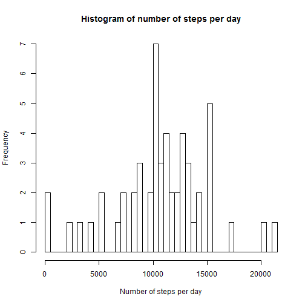
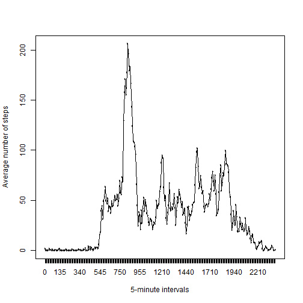
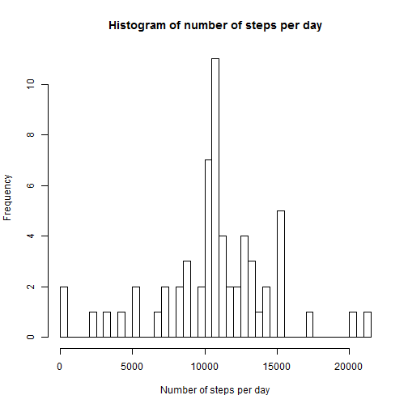
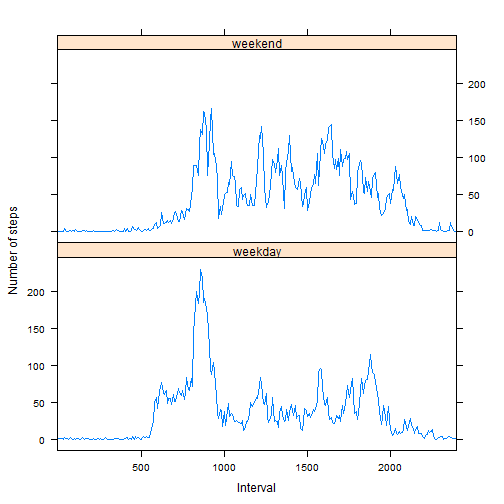

## Loading and preprocessing the data

1. Load the data:

```r
zip_name  <- "./activity.zip"
file_name <- "./activity.csv"

setwd("~/coursera/reproducible_research/RepData_PeerAssessment1")

if (!file.exists(zip_name))
    stop("Zipped data (from Git Hub) is not found!")
if (!file.exists(file_name)) # Unpack the data, if necessary
    unzip(zip_name)    
    
df <- read.csv(file_name, stringsAsFactors = FALSE)
```

2. Process/transform the data (if necessary) into a format suitable for your analysis:

A first quick glance to check that there a really 17,568 observations in this dataset as stated in the [README file](README.md) and that the file's header was read as expected giving proper column names:

```r
str(df)
```

```
## 'data.frame':	17568 obs. of  3 variables:
##  $ steps   : int  NA NA NA NA NA NA NA NA NA NA ...
##  $ date    : chr  "2012-10-01" "2012-10-01" "2012-10-01" "2012-10-01" ...
##  $ interval: int  0 5 10 15 20 25 30 35 40 45 ...
```

A second look to get information about columns with `NA`s:

```r
summary(df)
```

```
##      steps            date              interval     
##  Min.   :  0.00   Length:17568       Min.   :   0.0  
##  1st Qu.:  0.00   Class :character   1st Qu.: 588.8  
##  Median :  0.00   Mode  :character   Median :1177.5  
##  Mean   : 37.38                      Mean   :1177.5  
##  3rd Qu.: 12.00                      3rd Qu.:1766.2  
##  Max.   :806.00                      Max.   :2355.0  
##  NA's   :2304
```
Only the `steps` column contains `NA`s - the count is 2,304.

Now a data frame `df_no_nas` without `NA`s is created, resulting in 17,568 - 2,304 = 15,264 observations:

```r
df_no_nas <- df[!is.na(df$steps),]
str(df_no_nas)
```

```
## 'data.frame':	15264 obs. of  3 variables:
##  $ steps   : int  0 0 0 0 0 0 0 0 0 0 ...
##  $ date    : chr  "2012-10-02" "2012-10-02" "2012-10-02" "2012-10-02" ...
##  $ interval: int  0 5 10 15 20 25 30 35 40 45 ...
```

Finally we turn the date strings into factors (for both data frames) and have a last look at `df_no_nas` to be sure that no `NA`s have been left:

```r
df$date = as.factor(df$date)
df_no_nas$date = as.factor(df_no_nas$date)
summary(df_no_nas)
```

```
##      steps                date          interval     
##  Min.   :  0.00   2012-10-02:  288   Min.   :   0.0  
##  1st Qu.:  0.00   2012-10-03:  288   1st Qu.: 588.8  
##  Median :  0.00   2012-10-04:  288   Median :1177.5  
##  Mean   : 37.38   2012-10-05:  288   Mean   :1177.5  
##  3rd Qu.: 12.00   2012-10-06:  288   3rd Qu.:1766.2  
##  Max.   :806.00   2012-10-07:  288   Max.   :2355.0  
##                   (Other)   :13536
```

## What is mean total number of steps taken per day?

1. Make a histogram of the total number of steps taken each day:

There are 53 days with observations:

```r
num_of_all_days <- length(levels(df_no_nas$date))
num_of_all_days
```

```
## [1] 53
```


```r
steps_per_day_sum <- tapply(df_no_nas$steps, df_no_nas$date, sum)
hist(steps_per_day_sum, main = "Histogram of number of steps per day",
     xlab = "Number of steps per day", breaks = num_of_all_days)
```

 

2. Calculate and report the **mean** and **median** total number of steps taken per day:

```r
mean(steps_per_day_sum)
```

```
## [1] 10766.19
```

```r
median(steps_per_day_sum)
```

```
## [1] 10765
```

## What is the average daily activity pattern?

1. Make a time series plot of the 5-minute interval (x-axis) and the average number of steps taken, averaged across all days (y-axis):

Compute the sum of steps for each interval and then compute the average number of steps, averaged across all days:

```r
steps_per_interval_sum <- tapply(df_no_nas$steps, df_no_nas$interval, sum)
steps_per_interval_avg <- sapply(steps_per_interval_sum, 
                                 function(x) x / num_of_all_days)
```

Do the time series plot (ensuring that the 5-minute intervals are sorted numerically) ensuring that the points are connected with the `lines` function:

```r
interval_as_factor <- factor(sapply(names(steps_per_interval_avg), as.integer))
interval_avg_steps <- data.frame(interval = interval_as_factor, 
                                 steps = steps_per_interval_avg)

with(interval_avg_steps, plot(interval, steps, type = "l", 
                              xlab="5-minute intervals", 
                              ylab="Average number of steps"))
lines(interval_avg_steps$steps)
```

 

2. Which 5-minute interval, on average across all the days in the dataset, contains the maximum number of steps?

At first, compute the maximum number of steps on the basis of all 5-minute intervals on average across all the days in the dataset:

```r
steps_max <- max(steps_per_interval_avg)
steps_max
```

```
## [1] 206.1698
```

Second, compute the array`s element(s) containing - on average across all the days in the dataset - the maximum number (206.1698) of steps:

```r
steps_per_interval_avg[steps_per_interval_avg == steps_max]
```

```
##      835 
## 206.1698
```
It`s interval 835.

## Imputing missing values

1. Calculate and report the total number of missing values in the dataset (i.e. the total number of rows with `NA`s).

```r
nrow(df) - sum(complete.cases(df))
```

```
## [1] 2304
```
2,304 as expected because it was reported in `summary(df)` as the `steps` column's count for `NA`s.

A different approach which produces the same result:

```r
sum(apply(df, 1, function(x) any(is.na(x)) ))
```

```
## [1] 2304
```

2. Devise a strategy for filling in all of the missing values in the dataset. The strategy does not need to be sophisticated. For example, you could use the mean/median for that day, or the mean for that 5-minute interval, etc.

Each missing value is a `steps` value and for each missing value, `date` and `interval` are at hand. For simplicity, I will ignore the `date` and therefore concentrate on the given `interval`.
I pickup the idea to compute the mean for the 5-minute interval which is in the current focus. 

3. Create a new dataset that is equal to the original dataset but with the missing data filled in.

The strategy descibed above is implemented straightforward with a function and a `for` loop rolling over the new data frame's rows while replacing `NA`s with a number of steps which is derived from the observed values of the row-specific interval:

```r
df_new <- df

choose_steps <- function (interval) {
    all_steps <- df_no_nas[df_no_nas$interval == interval, "steps"]
    as.integer(mean(all_steps))
}

for (index in 1:nrow(df_new)) { 
    if(is.na(df_new[index, "steps"]))
        df_new[index, "steps"] <- choose_steps(df_new[index, "interval"])
} 
```

4. Make a histogram of the total number of steps taken each day and Calculate and report the mean and median total number of steps taken per day. Do these values differ from the estimates from the first part of the assignment? What is the impact of imputing missing data on the estimates of the total daily number of steps?

Now there are 61 days with observations (imputing values gives us 8 additional days):

```r
num_of_all_days <- length(levels(df_new$date))
num_of_all_days
```

```
## [1] 61
```

Here's the histogram:

```r
steps_per_day_sum <- tapply(df_new$steps, df_new$date, sum)
hist(steps_per_day_sum, main = "Histogram of number of steps per day",
     xlab = "Number of steps per day", breaks = num_of_all_days)
```

 

The mean and median values are:

```r
mean(steps_per_day_sum)
```

```
## [1] 10749.77
```
Estimate from the first part of the assignment was 10,766.19.


```r
median(steps_per_day_sum)
```

```
## [1] 10641
```
Estimate from the first part of the assignment was 10,765.  
In fact, each of the 8 "new" days was added with 10,641 steps (it's the sum of the means of every 5-minute interval). When sorting the days by the sum of every days's total steps, you will find 8 occurrences of 10,641 "in the middle" - one of them becoming the median:

```r
sort(steps_per_day_sum)
```

```
## 2012-11-15 2012-10-02 2012-10-25 2012-11-08 2012-11-20 2012-10-29 
##         41        126       2492       3219       4472       5018 
## 2012-11-16 2012-10-26 2012-11-29 2012-11-13 2012-11-06 2012-10-24 
##       5441       6778       7047       7336       8334       8355 
## 2012-10-21 2012-11-19 2012-10-23 2012-10-30 2012-10-10 2012-10-18 
##       8821       8841       8918       9819       9900      10056 
## 2012-10-27 2012-10-15 2012-11-28 2012-10-11 2012-10-20 2012-11-05 
##      10119      10139      10183      10304      10395      10439 
## 2012-11-03 2012-11-02 2012-10-01 2012-10-08 2012-11-01 2012-11-04 
##      10571      10600      10641      10641      10641      10641 
## 2012-11-09 2012-11-10 2012-11-14 2012-11-30 2012-11-12 2012-10-07 
##      10641      10641      10641      10641      10765      11015 
## 2012-11-26 2012-10-03 2012-10-28 2012-10-19 2012-11-25 2012-10-04 
##      11162      11352      11458      11829      11834      12116 
## 2012-10-13 2012-11-11 2012-11-21 2012-10-09 2012-11-07 2012-10-05 
##      12426      12608      12787      12811      12883      13294 
## 2012-10-17 2012-10-22 2012-11-27 2012-11-17 2012-11-24 2012-10-16 
##      13452      13460      13646      14339      14478      15084 
## 2012-10-14 2012-11-18 2012-10-31 2012-10-06 2012-10-12 2012-11-22 
##      15098      15110      15414      15420      17382      20427 
## 2012-11-23 
##      21194
```
The mean above (10,749.77) decreased a little bit because 8 days with a total of 10,641 steps and therefore smaller  than the first part's mean (10,766.19) had been added to the observations.

## Are there differences in activity patterns between weekdays and weekends?

1. Create a new factor variable in the dataset with two levels - "weekday" and "weekend" indicating whether a given date is a weekday or weekend day.

Because the **weekdays()**-function returns localized weekday names, we need
to remember the current language settings and then set them to English.

```r
my_locale <- Sys.getlocale("LC_TIME")
Sys.setlocale("LC_TIME", "English")
```

```
## [1] "English_United States.1252"
```

Add a new **day_type** factor column to the data set (with values "weekday" and "weekend" - of course "weekend" is chosen in case of "Saturday" or "Sunday"):

```r
df_new$day_type <- as.factor(
    sapply(df_new$date,
           function(x) {
               day <- weekdays(as.Date(x))
               if(day %in% c("Saturday", "Sunday")) 
                   "weekend" 
               else 
                   "weekday"
           })
)
summary(df_new)
```

```
##      steps                date          interval         day_type    
##  Min.   :  0.00   2012-10-01:  288   Min.   :   0.0   weekday:12960  
##  1st Qu.:  0.00   2012-10-02:  288   1st Qu.: 588.8   weekend: 4608  
##  Median :  0.00   2012-10-03:  288   Median :1177.5                  
##  Mean   : 37.33   2012-10-04:  288   Mean   :1177.5                  
##  3rd Qu.: 27.00   2012-10-05:  288   3rd Qu.:1766.2                  
##  Max.   :806.00   2012-10-06:  288   Max.   :2355.0                  
##                   (Other)   :15840
```

Now we can restore the language settings:

```r
Sys.setlocale("LC_TIME", my_locale)
```

```
## [1] "German_Germany.1252"
```

2. Make a panel plot containing a time series plot of the 5-minute interval (x-axis) and the average number of steps taken, averaged across all weekday days or weekend days (y-axis).

Count the weekdays and the weekend days (the total is 61 days):

```r
num_of_week_days <- length(unique(
    df_new[df_new$day_type == "weekday", "date"]))
num_of_weekend_days <- length(unique(
    df_new[df_new$day_type == "weekend", "date"]))
```

Split the data frame according to **day_type** into a list of two data_frames:

```r
df_split <- split(df_new, df_new$day_type)
```

Compute the sum of steps for each interval and then compute the average number of steps, averaged across all days:

```r
steps_per_interval_sum_wd <- tapply(df_split[1][["weekday"]]$steps, df_split[1][["weekday"]]$interval, sum)
steps_per_interval_avg_wd <- sapply(steps_per_interval_sum_wd, 
                                 function(x) x / num_of_week_days)

steps_per_interval_sum_we <- tapply(df_split[2][["weekend"]]$steps, df_split[2][["weekend"]]$interval, sum)
steps_per_interval_avg_we <- sapply(steps_per_interval_sum_we, 
                                 function(x) x / num_of_weekend_days)
```

Create the two "average" data frames and combine them into one:

```r
df_weekday <- data.frame(steps = steps_per_interval_avg_wd, 
                         interval = factor(sapply(names(steps_per_interval_avg_wd),
                                                  as.integer)))
df_weekday <- `$<-`(df_weekday,"day_type","weekday") # add column with constant values

df_weekend <- data.frame(steps = steps_per_interval_avg_we, 
                         interval = factor(sapply(names(steps_per_interval_avg_we),
                                                  as.integer)))
df_weekend <- `$<-`(df_weekend,"day_type","weekend") # add column with constant values

steps_per_interval_avg <- rbind(df_weekday, df_weekend)
steps_per_interval_avg$day_type <- as.factor(steps_per_interval_avg$day_type)
```

Finally do the time series plot of the 5-minute interval (x-axis) and the average number of steps taken, averaged across all weekday days or weekend days (y-axis) while making the labels for the x-axis values readable:

```r
library(lattice)
x_labels <- as.character(steps_per_interval_avg$interval)
xyplot(steps ~ interval | day_type, data = steps_per_interval_avg, 
       layout = c(1,2), type="l", xlab = "Interval", ylab ="Number of steps",
       scales=list(x=list(at=seq(from = 61, to = 241, by = 60), 
                   labels=c(x_labels[0], x_labels[61], x_labels[121], 
                            x_labels[181], x_labels[241])))
)
```

 

